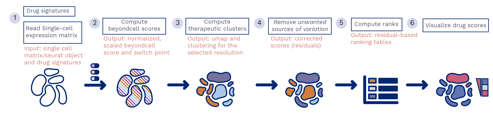

[Package status](https://gitlab.com/bu_cnio/beyondcell/commits/CRAN)

## Introduction
**beyondcell** is a methodology for the identification of drug vulnerabilities in single cell RNA-seq data. To this end, beyondcell focuses on the analysis of drug-related commonalities between cells by classifying them into distinct therapeutic clusters.

## Workflow overview



**beyondcell workflow.** Given two inputs, the scRNA-seq expression matrix and a collection of drug signatures, the methodology calculates a beyondcell score (BCS) for each drug-cell pair. The BCS ranges from 0 to 1 and measures the susceptibility of each cell to a given drug. The resulting BCS matrix can be used to determine the sample’s therapeutic clusters. Furthermore, drugs are prioritized in a table and each individual drug score can be visualized in a UMAP.


Depending on the evaluated signatures, the BCS represents the cell perturbation susceptibility (PSc) and the sensitivity to the drug effect (SSc). BCS can also be estimated from functional signatures  to evaluate each cell functional status.

## beyoncell's key applications
 * Analyze the intratumoural heterogeneity of your experiment 
 * Classify your cells into therapeutic clusters
 * Prioritize cancer treatments
 * If time points are available, identify the changes in drug tolerance of your samples
 * Identify mechanisms of resistance

## Installing beyondcell
We recommend installing **beyondcell** via gitlab using devtools:

```r
library("devtools")
devtools::install("bu_cnio/beyondcell")
```

See the DESCRIPTION file for a complete list of R dependencies. If the R dependencies are already installed, installation should finish promptly.

## Results


We have validated beyondcell in a population of MCF7-AA cells exposed to 500nM of bortezomib and collected at different time points: t0 (before treatment), t12, t48 and t96 (72h treatment followed by drug wash and 24h of recovery) obtained from *Ben-David U, et al., Nature, 2018*. We integrated all four conditions using the Seurat pipeline (left). After calculating the beyondcell scores (BCS) for each cell, a clustering analysis was applied. beyondcell was able to cluster the cells based on their treatment time point, to separate untreated cells from treated cells (center) and to recapitulate the changes arisen by the treatment with bortezomib. 


## How to run
For general instructions on running beyondcell, check out the [tutorial](https://gitlab.com/bu_cnio/beyondcell/-/tree/CRAN/tutorial). 


## Authors
 * Coral Fustero-Torre
 * María José Jiménez
 * Santiago García-Martín
 * Carlos Carretero-Puche
 * Luis G. Jimeno
 * Tomás Di Domenico
 * Gonzalo Gómez-López
 * Fátima Al-Shahrour

## References

## Support
If you have any question regarding the use of **beyoncell**, feel free to submit an [issue](https://gitlab.com/bu_cnio/beyondcell/issues/new/choose).
