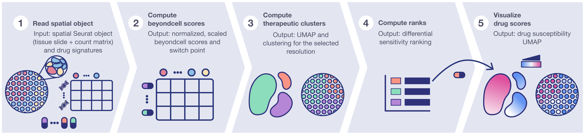
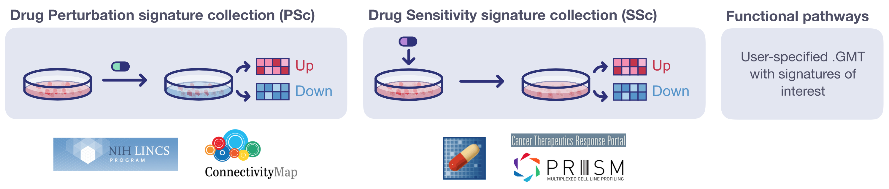

[Package status](https://github.com/cnio-bu/beyondcell/commits/master)

> **News:** Beyondcell 2.1.0 has been added to bu_cnio conda channel. 
<!--and from now on it will be updated exclusively in that channel. -->

## Introduction
**Beyondcell** is a methodology for the identification of drug vulnerabilities 
in single-cell RNA-seq (scRNA-seq) and Spatial Transcriptomics (ST) data. To this end, beyondcell focuses on the analysis of drug-related commonalities between cells/spots by classifying them into distinct Therapeutic Clusters (TCs).

## Workflow overview

**Beyondcell workflow.** Given two inputs, the expression matrix and a 
collection of drug signatures, the methodology calculates a Beyondcell Score 
(BCS) for each drug-cell/spot pair. The BCS ranges from 0 to 1 and measures the 
susceptibility of each cell/spot to a given drug. The resulting BCS matrix can be 
used to determine the sample’s TCs. Furthermore, drugs are prioritized in a 
table and each drug score can be visualized in a UMAP. When using ST data, the TCs and individual scores can also be visualized on top of the tissue slice to dissect the therapeutic architecture of the sample.



Depending on the evaluated signatures, the BCS represents the cell/spot perturbation 
susceptibility (PSc) or the sensitivity to the drug effect (SSc). BCS can also 
be estimated from functional signatures  to evaluate each cell/spot functional 
status.



## Beyondcell's key applications
 * Analyse the intratumoural heterogeneity (ITH) of your experiment 
 * Classify your cells/spots into TCs
 * Prioritize cancer treatments
 * If time points are available, identify the changes in drug tolerance
 * Identify mechanisms of resistance

## Installing beyondcell
The beyondcell package is implemented in R >= 4.0.0. We recommend 
running the installation via mamba: 

```r
# Create a conda environment.
conda create -n beyondcell 
# Activate the environment.
conda activate beyondcell
# Install beyondcell package and dependencies.
mamba install -c bu_cnio r-beyondcell
```

## Results
We have validated beyondcell in a population of MCF7-AA cells exposed to 500nM 
of bortezomib and collected at different time points: t0 (before treatment), 
t12, t48, and t96 (72h treatment followed by drug wash and 24h of recovery) 
obtained from *Ben-David U, et al., Nature, 2018*. We integrated all four 
conditions using the Seurat pipeline (left). After calculating the BCS for each 
cell using PSc, a clustering analysis was applied. Beyondcell was able to 
cluster the cells based on their treatment time point, to separate untreated 
cells from treated cells (center), and to recapitulate the changes arising from the 
treatment with bortezomib (right). 


## How to run
For general instructions on running beyondcell, check out the [analysis workflow](https://github.com/cnio-bu/beyondcell/blob/master/tutorial/analysis_workflow/README.md) and [visualization](https://github.com/cnio-bu/beyondcell/blob/master/tutorial/visualization/README.md) tutorials.
For more information about how beyondcell normalization works, please refer to [this vignette](https://github.com/cnio-bu/beyondcell/blob/master/tutorial/BCS_normalization/README.md). 


## Authors

 * Coral Fustero-Torre
 * María José Jiménez-Santos
 * Santiago García-Martín
 * Carlos Carretero-Puche
 * Luis García-Jimeno
 * Tomás Di Domenico
 * Gonzalo Gómez-López
 * Fátima Al-Shahrour


## Citation
Fustero-Torre, C., Jiménez-Santos, M.J., García-Martín, S. et al. Beyondcell: targeting cancer therapeutic heterogeneity in single-cell RNA-seq data. Genome Med 13, 187 (2021). https://doi.org/10.1186/s13073-021-01001-x

## Support
If you have any questions regarding the use of beyondcell, feel free to submit an [issue](https://github.com/cnio-bu/beyondcell/issues).
