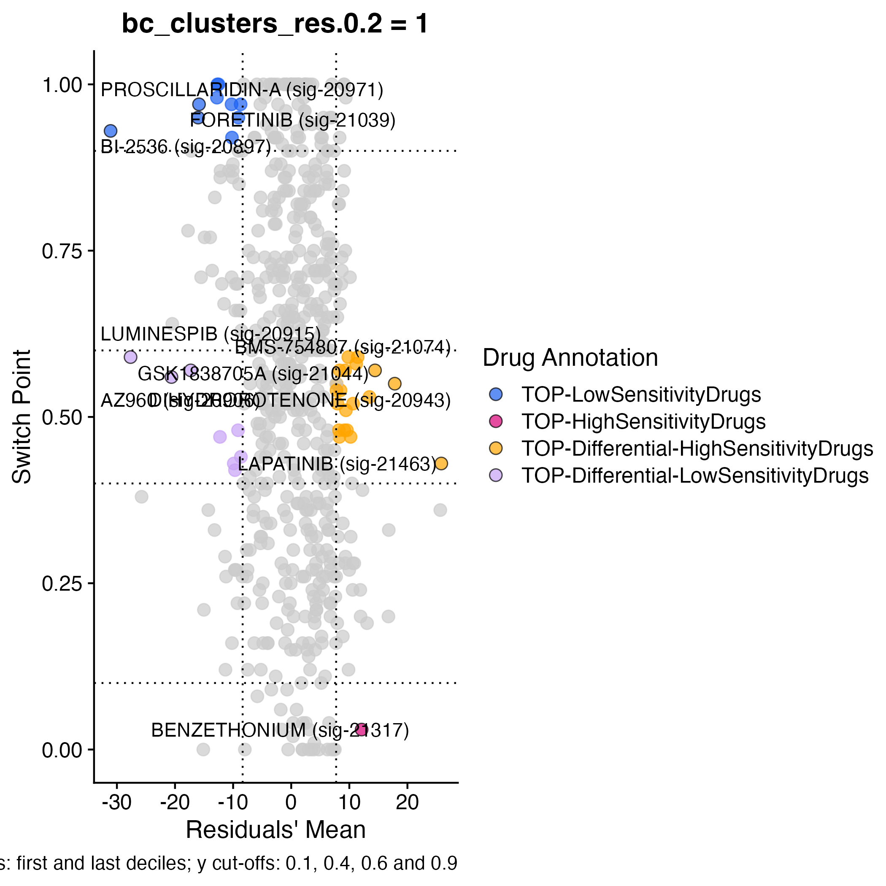

# Spatial Transcriptomics analysis

## Data access:
We are analyzing an FFPE sample with pathologist annotations from a ductal carcinoma 
patient obtained from the [10x Genomics Datasets portal](https://www.10xgenomics.com/resources/datasets/human-breast-cancer-ductal-carcinoma-in-situ-invasive-carcinoma-ffpe-1-standard-1-3-0). 
We preprocessed these data using the pipelines in 
[ST-preprocess repository](https://github.com/cnio-bu/ST-preprocess). The resulting 
`Seurat` object, stored in `738811QB_spatial_SCTnormalised_clones.rds` file, can be 
accessed through the following [link](https://zenodo.org/records/10650162).

## Using beyondcell

### Read the ST object
First, we load the `Seurat` object.

```r
library("beyondcell")
library("Seurat")
library("ggplot2")
set.seed(1)
path_to_st <- "~/Downloads/738811QB_spatial_SCTnormalised_clones.rds"
# Read spatial transcriptomics experiment.
st <- readRDS(path_to_st)
```

### Compute the BCS
Next, we generate a `geneset` object containing the SSc signatures. The SSc 
collection reflects the transcriptional differences between sensitive and 
resistant cancer cell lines before drug treatment. Thus, these signatures 
are helpful in predicting drug response in treatment-naive samples like 
the one we are analyzing.

```r
# Generate geneset object with SSc signatures.
gs <- GetCollection(SSc, include.pathways = FALSE)
```

Then, we can compute the Beyondcell Scores (BCS).

```r
# Set Assay.
DefaultAssay(st) <- "SCT"
# Compute BCS.
bc <- bcScore(st, gs, expr.thres = 0.1)
```

### Compute the TCs
After obtaining our `beyondcell` object, we group the spots into Therapeutic Clusters (TCs) 
based on their predicted response to the SSc collection.

```r
# Run the UMAP reduction. 
bc <- bcUMAP(bc, k.neighbors = 20, res = 0.2)
# Run the bcUMAP function again, specifying the number of principal components 
# you want to use.
bc <- bcUMAP(bc, pc = 10, k.neighbors = 20, res = 0.2)
```

When we compare the TCs with the pathologist annotations, we can observe that the fibrous 
tissue corresponds to TC0, the invasive carcinoma to TC1, and the necrosis to TC3. Moreover, 
TC2 seemed composed of immune cells and fibrous tissue in close contact with cancer 
cells.

```r
# Visualize the TCs and the pathologist annotations.
pathologist_colors <- 
  c(Fibrous_tissue = "#D2362A", Invasive_carcinoma = "#296217", 
    Necrosis = "#F9D94A", Immune_cells = "#932CE7", Fat = "#1400F5")
bcClusters(bc, idents = "bc_clusters_res.0.2", spatial = TRUE, pt.size = 1.5) |
  bcClusters(bc, idents = "Pathologist", spatial = TRUE, pt.size = 1.5) +
  scale_fill_manual(values = pathologist_colors)
```


### Compute ranks
We are interested in identifying drugs that specifically target cancer cells. We 
compute a signature ranking using the `bcRanks` function to do so. Then, we plot 
this ranking using the `bc4Squares` function. As we are interested in the drugs that 
specifically target TC1, we will focus on the orange area of the plot, which depicts 
the drugs with intermediate Switch Points (indicating a heterogeneous response in the 
sample) and positive residual's mean (indicating higher sensitivity in TC1 compared 
to the rest of spots).

```r
# Prioritize drugs for each TC.
bc <- bcRanks(bc, idents = "bc_clusters_res.0.2", extended = FALSE)
# Find drugs to specifically target TC1 (cancer cells).
bc4Squares(bc, idents = "bc_clusters_res.0.2", lvl = "1")
```



### Plot drug sensitivity predictions
According to the previous plot, lapatinib is the best drug to target TC1 
specifically. Lapatinib is a *ERBB2* inhibitor approved by the FDA to 
treat HER2+ breast cancers. Accordingly, we observe a high expression 
of this biomarker in cancer cells, which correlates with lapatinib sensitivity.

```r
# Plot the predicted sensitivity to lapatinib and ERBB2 expression.
bcSignatures(bc, signatures = list(values = "sig-21463"), spatial = TRUE, pt.size = 1.5) |
  bcSignatures(bc, genes = list(values = "ERBB2"), spatial = TRUE, pt.size = 1.5)
```


## Support
Additional information can be found in the package's documentation and in the 
[analysis workflow](https://github.com/cnio-bu/beyondcell/blob/master/tutorial/analysis_workflow/README.md) or [visualization](https://github.com/cnio-bu/beyondcell/blob/master/tutorial/visualization/README.md) tutorials. If you have any questions regarding the use of **beyondcell**, 
feel free to submit an [issue](https://github.com/cnio-bu/beyondcell/issues).