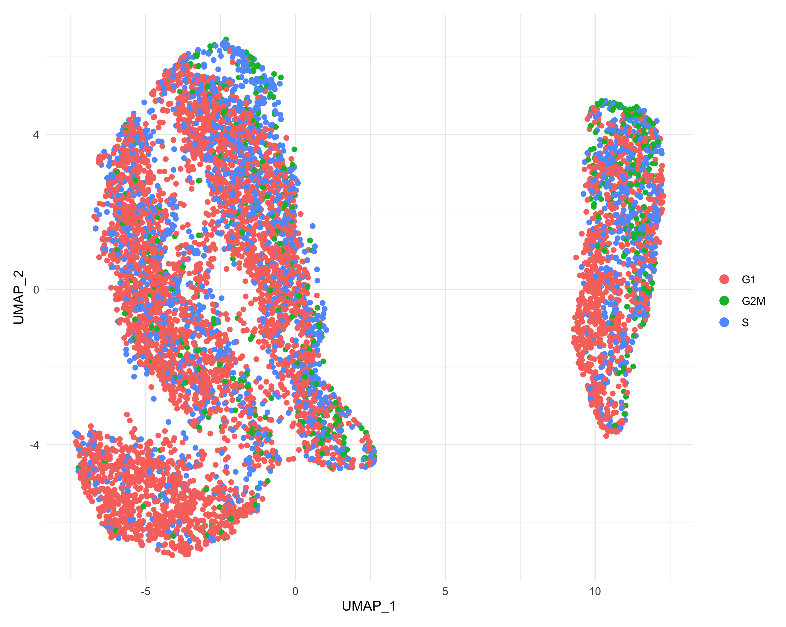
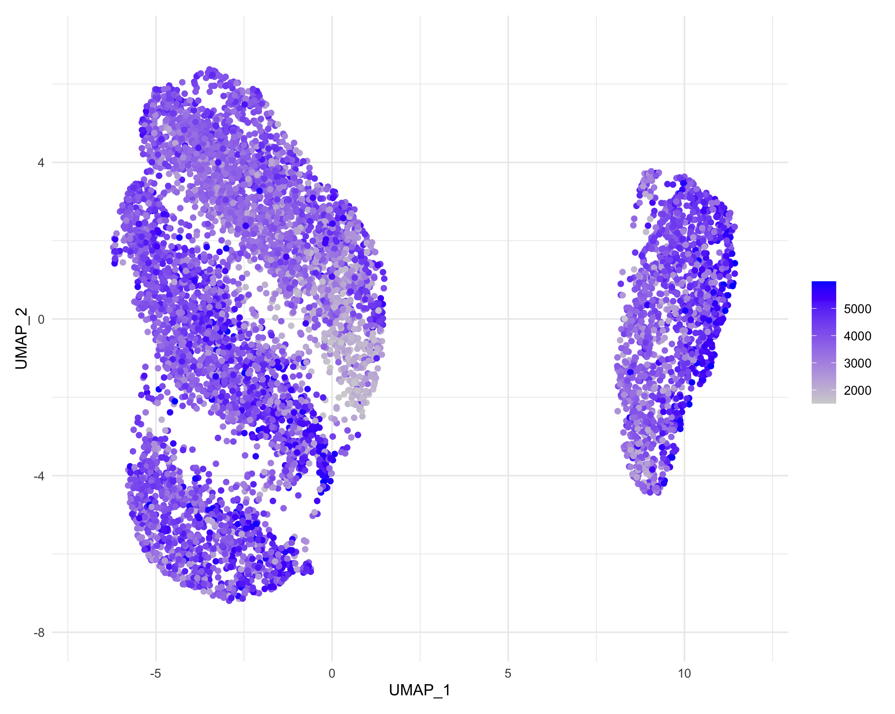
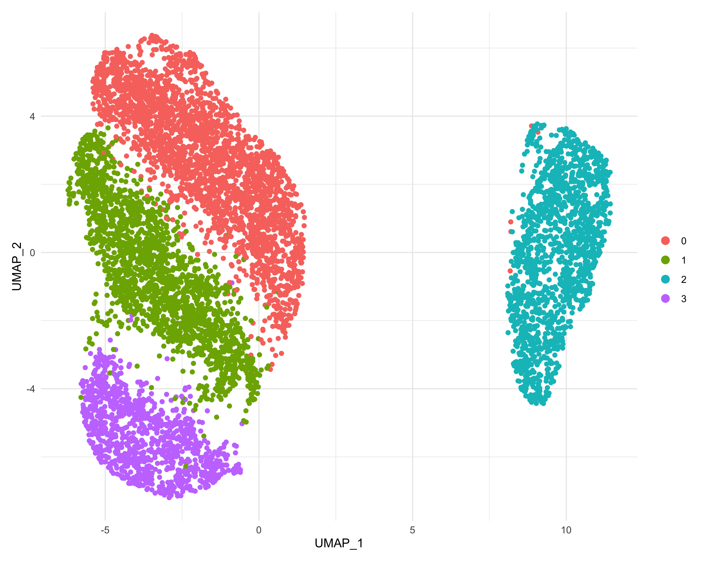

# Analysis workflow

## Data access:
We have validated Beyondcell in a population of MCF7-AA cells exposed to 500nM of bortezomib and collected at different time points: t0 (before treatment), t12, t48 and t96 (72h treatment followed by drug wash and 24h of recovery) obtained from *Ben-David U, et al., Nature, 2018*. We integrated all four conditions using the Seurat pipeline. To follow this tutorial, the resulting seurat object can be accessed through the following [link](https://zenodo.org/record/4438620). 


## Using Beyondcell
For a correct analysis with **Beyondcell**, users should follow these steps: 

 1. Read single cell expression matrix
 2. Compute Beyondcell scores
 3. Compute Therapeutic clusters
    * Check clustering and look for unwanted sources of variation
    * Regress out unwanted sources of variation
    * Recompute UMAP
 4. Compute ranks
 5. [**Visualize**](https://gitlab.com/bu_cnio/Beyondcell/-/tree/master/tutorial/visualization) the results


### 1. Read single cell expression object
In order to correctly compute the scores, the transcriptomic data needs to be pres-processed. This means that proper cell-based quality control filters, as well as normalization, scaling and clustering of the data, should be applied prior to the analysis with **Beyondcell**. 

```r
library("Beyondcell")
library("Seurat")
# Read single cell experiment
sc = readRDS(path_to_sc)
```

### 2. Compute BCS
The `bcCompute` function allows you to input either a pre-processed seurat object or a single cell matrix. Have in mind, that when a seurat object is used as an input, the `DefaultAssay` must be specified, both `SCT` and `RNA` assays are accepted.

```r
# Set Assay
DefaultAssay(sc) <- "RNA"
```
**Generate Signatures**\
In order to compute the BCS, we also need a **gene signatures object** containing the drug or functional signatures we are interested in evaluating. To create this object, the `GenerateGenesets` function needs to be called. **Beyondcell** includes two drug signature collections that are ready to use:

 * The drug Perturbation Signatures collection (PSc): captures the transcriptional changes induced by a drug.
 * The drug Sensitivity  Signatures collection (SSc): captures the drug sensitivity to a given drug.

A small collection of functional pathways will be included by default in your gene signatures object. These pathways are related to the regulation of the epithelial-mesenchymal transition (EMT), cell cycle, proliferation, senescence and apoptosis.  

```r
# Generate gene signatures object with one of the ready to use signature collections
gs <- GenerateGenesets(PSc, include.pathways = TRUE)
# You can deactivate the functional pathways option if you are not interested in evaluating them
gs <- GenerateGenesets(PSc, include.pathways = FALSE)
```

Furthermore, **Beyondcell** allows the user to input a .GMT file containing the functional pathways/signatures of interest, or a numeric matrix (containing a ranking criteria such as the t-statistic or logFoldChange).

You can check out the structure of the obtained gene set object, information on the drug signatures, mode of action and target genes can be found at `gs@info` or by using the `FindDrugs` function. 

**Compute BCS**
```r
# Compute score for the PSc. This might take a few minutes depending on the size of your dataset.
bc <- bcScore(sc, gs, expr.thres = 0.1) 
```
> TIP: we recommend to input cells with at least 1000-1500 genes detected.


### 3. Compute Therapeutic clusters
The ouput of the `bcScore` computation is a `bc object`. The object contains the normalized and scaled **Beyondcell** scores and switch point, as well as information concerning the parameters used for the analysis. The bc object can be used as an input for a dimensionality reduction and clustering analysis, using the `bcUMAP`function. With this analysis, cells can be classified into distinct **therapeutic clusters**, that represent sets of cells sharing a common response to a particular drug exposition. The Uniform Manifold Approximation and Projection (UMAP) will allow the visualization of the identified clusters. 

> TIP: If pc = NULL (default), the function will stop prior to compute the UMAP projection and the therapeutic clusters. This first step will print and elbow plot in your screen and will help you chose the number of components needed for the UMAP computation.

```r
# Run the UMAP reduction. 
bc <- bcUMAP(bc)
# Run the bcUMAP function again, specifying the number of principal components you want to use.
bc <- bcUMAP(bc, pc = 5, res = 0.2)
```

**Check clustering**\
It is important to check whether any unwanted source of variation is guiding the clustering analysis. The `bcClusters` function allows us to colour the UMAP based on the metadata variables that migth be influencing the clustering. We recommend checking these sources of variation among others:

 * Number of detected genes per cell
 * Number of detected counts
 * Cell cycle phase
 * Batch

```r
# Visualize whether cells are clustered based on the number of genes detecter per each cell
bcClusters(bc, UMAP = "Beyondcell", idents = "nFeature_RNA", factor.col = FALSE)
```


```r
# Visualize whether cells are clustered based on their cell cycle status
bcClusters(bc, UMAP = "Beyondcell", idents = "Phase", factor.col = TRUE)
```


> TIP: the cell cycle information must be present in bc@meta.data and can be obtained using Seurat's function `CellCycleScoring`

**Regress out unwanted sources of variation**\
The `bcRegressOut` function will allow us to correct existing sources of variation. Have in mind that the number of detected genes per cell will *always* have an inpact in the final score.

```r
bc <- bcRegressOut(bc, vars.to.regress = c("nFeature_RNA"))
```
> TIP: is the regression step taking too long? Check the amount of NAs per cell of your bc@normalized matrix. You migth need to refine the filtering of your single cell experiment based on the amount of detected features.

**Recompute Therapeutic clusters**\
Once corrected, you will need to recompute the dimensionality reduction and clustering, in order to find the *true* **therapeutic clusters** present in your sample. 

```r
# Recompute UMAP
bc <- bcUMAP(bc, pc = 5, res = 0.2, add.DSS = FALSE, k.neighbors = 20) 
# Visualize UMAP
bcClusters(bc, UMAP = "Beyondcell", idents = "nFeature_RNA", factor.col = FALSE, pt.size = 1)
# Visualize Therapeutic clusters
bcClusters(bc, UMAP = "Beyondcell", idents = "bc_clusters_res.0.2", pt.size = 1)
```

<p float="left">
  
  
</p>

### 4. Compute ranks
A summary table can be obtained using the `bcRanks`function. This table includes summary metrics such as: the Switch Point (SP), mean, median, sd, variance, min, max, proportion of NaN and residuals' mean of each signature. This table aims to help you in the prioritization of drug candidates. 

```r
# Obtain general statistics
bc <- bcRanks(bc)
# Obtain condition-based statistics
bc <- bcRanks(bc, idents = "condition")
head(bc@ranks$condition)
# Obtain therapeutic cluster-based statistics
bc <- bcRanks(bc, idents = "bc_clusters_res.0.2")
```
The summary tables are saved in the slot `ranks` as a data frame. You can access them as follows:

```r
# Explore the statistics table
head(bc@ranks$general) 
```

> TIP: We recommend prioritizing drugs taking into account both the switch point and residuals. 

> Concerning the SP: It determines the value where negative scores switch to positive scores and vice versa. As an example, an all-sensitive dataset will have SP equal to zero, as there won’t be any negative scores for that specific drug in the whole population and a dataset insensitive to a certain drug, will be expected to have a SP close to 1. Intermediate SP, as a contrast, will reflect that the dataset contains both susceptible and non-susceptible cells.
