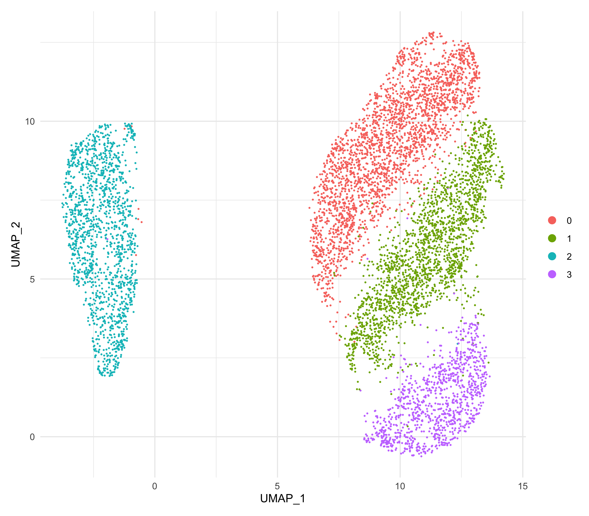
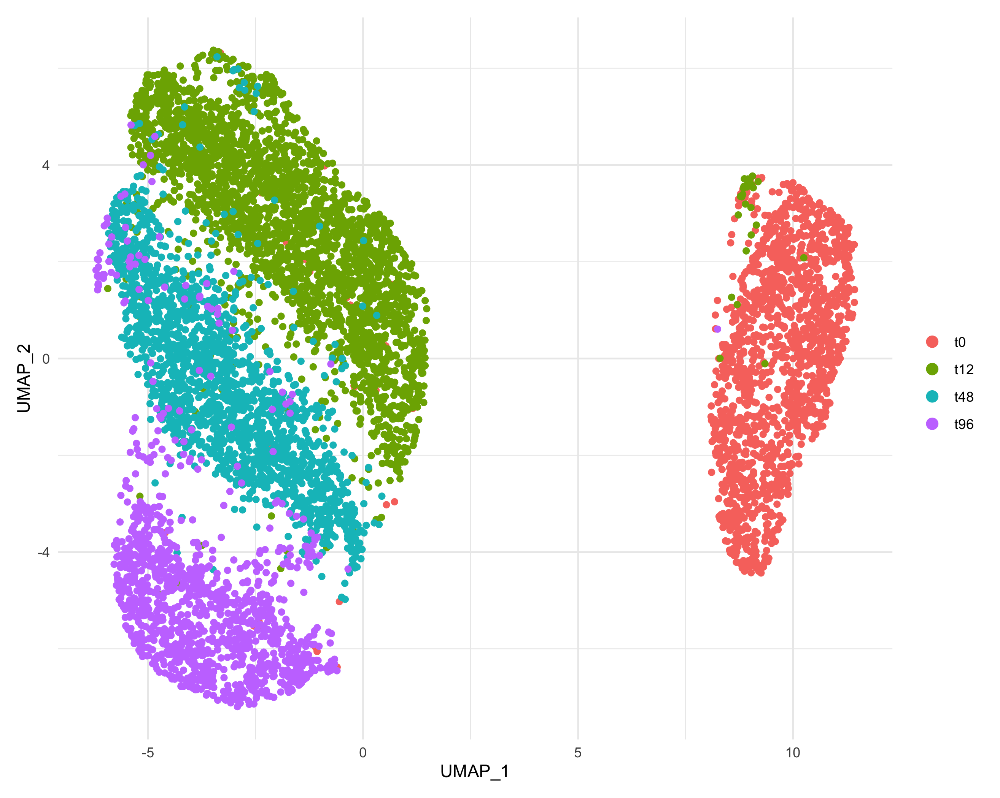
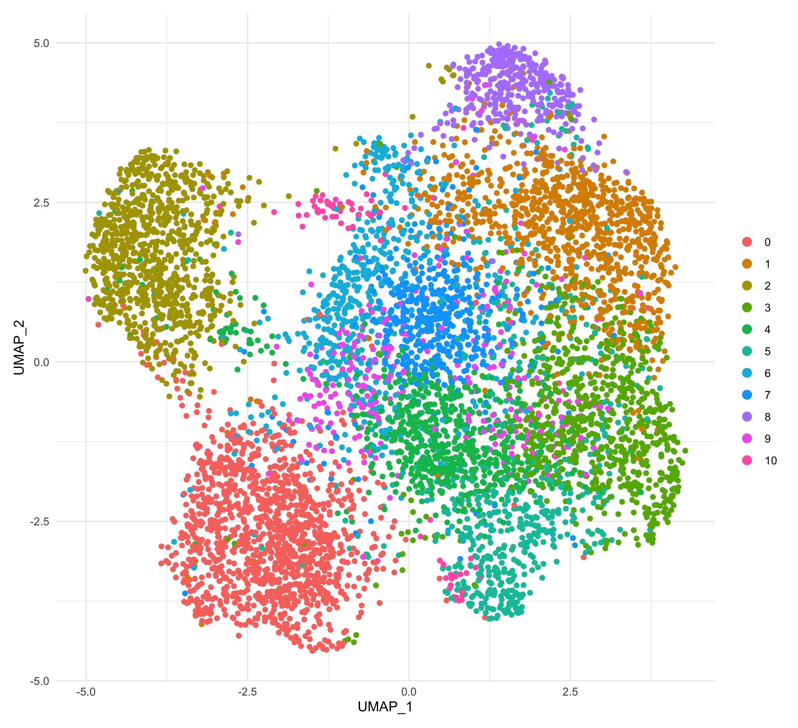
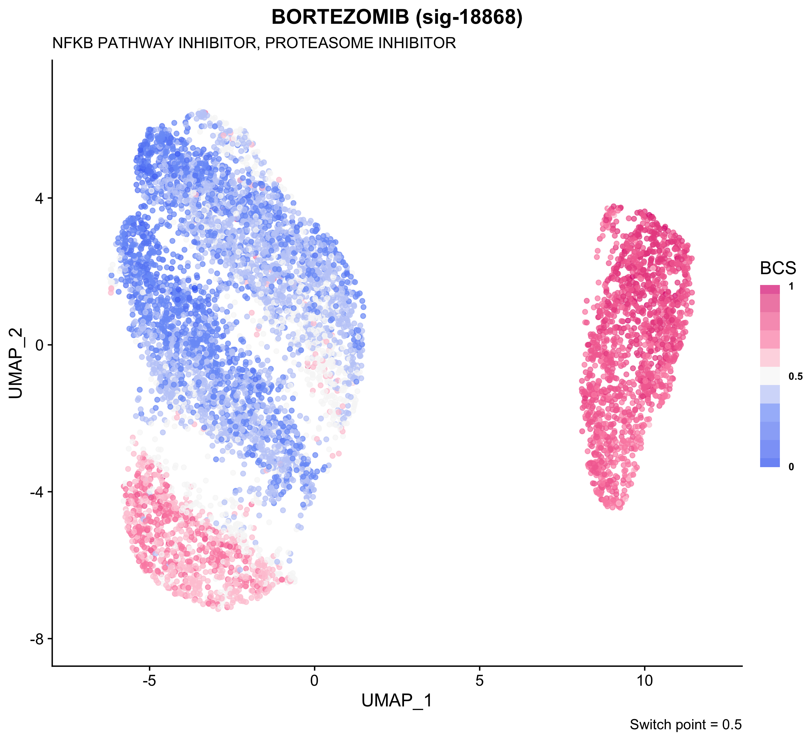
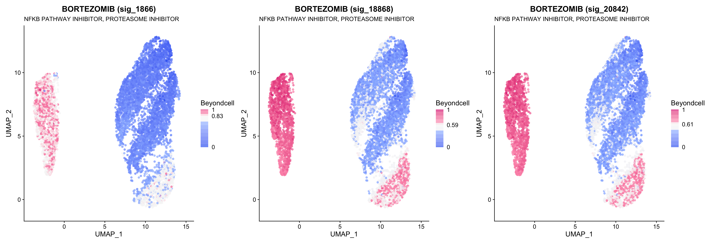
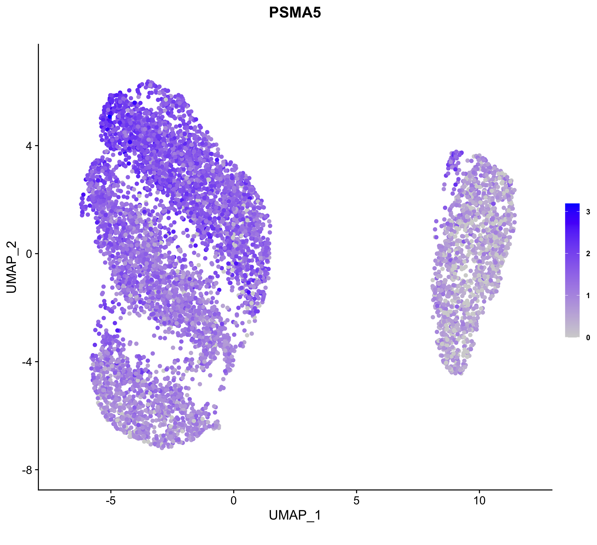
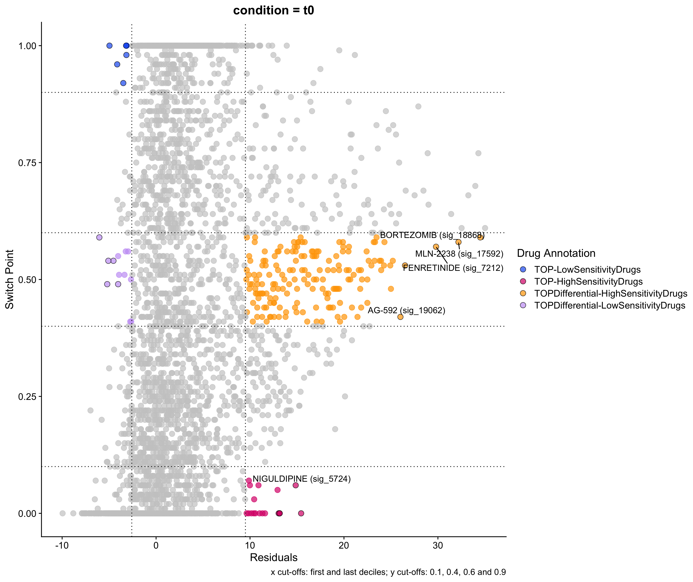
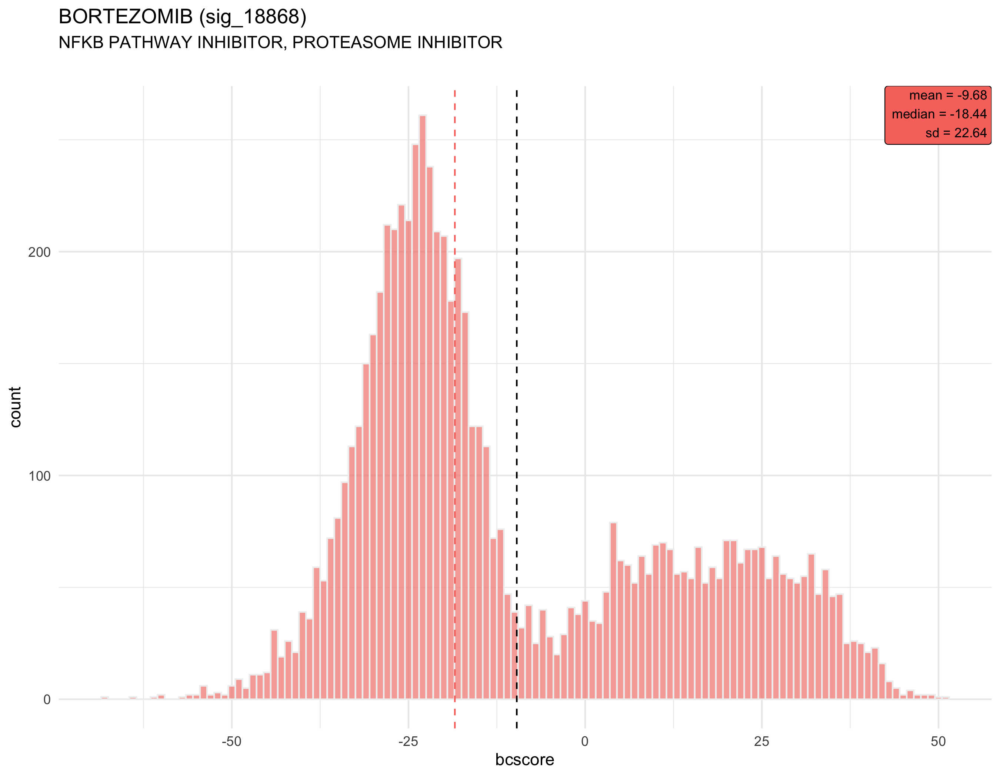
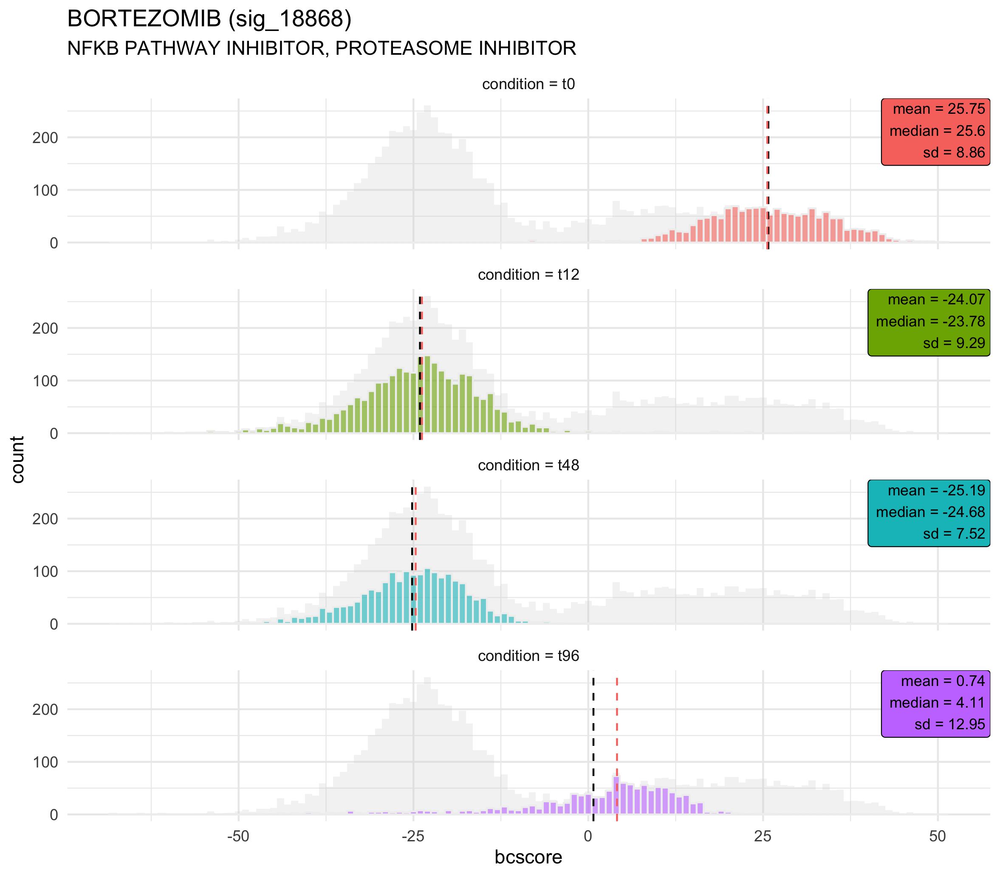
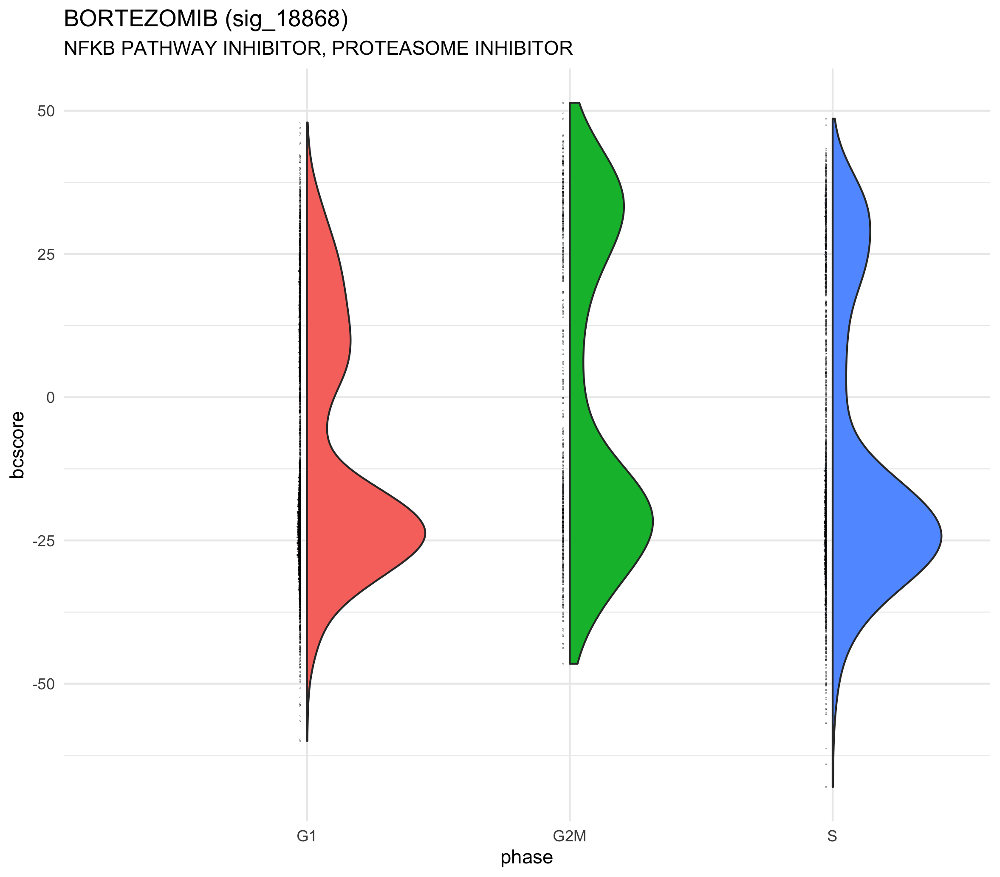

# Visualization of the results
**Beyondcell** provides several visualization functions to help you better understand the results.

| **Function** | **Description** |
| -------------- | -------------- |
| **`bcClusters()`** | Returns a `ggplot2` object with a UMAP reduction (either beyondcell's or Seurat's) colored by the specified metadata column. |
| **`bcSignatures()`**|Returns a list of `patchwork` or `ggplot2` objects with the desired UMAP reduction (either beyondcell's or Seurat's) colored by Beyondcell Scores (BCS) or gene expression values. |
| **`bcHistogram()`** | Drawns a histogram of BCS for each signature of interest. The plot can be a single histogram (if `idents = NULL`) or a histogram for each level found in `idents`. |
| **`bcCellCycle()`** | Drawns, for each signature of interest, a `geom_violindot` plot of the BCS grouped by cell cycle phase (G1, G2M or S). Note that this information must be present in `bc@meta.data` and can be obtained using Seurat's function `CellCycleScoring`.|
| **`bc4Squares()`** | Drawns a 4 squares plot of the drug signatures present in a `beyondcell` object. |

## Data
In this tutorial, we are analyzing a population of MCF7-AA cells exposed to 
500nM of bortezomib and collected at different time points: t0 (before 
treatment), t12, t48, and t96 (72h treatment followed by drug wash and 24h of 
recovery) obtained from *Ben-David U, et al., Nature, 2018*. We integrated all 
four conditions using the Seurat pipeline. After calculating the BCS for each 
cell and regressing unwanted sources of variation, a clustering analysis was 
applied. 

## Metadata visualization
Once the BCS and the UMAP reductions are computed, we can check out how the 
different metadata variables behave. General quality control variables such as
the number of features per cell/spot or the cell cycle phase can be analyzed with 
`bcClusters` function (previously shown). Moreover, we can visualize the 
**Therapeutic Clusters** (TCs) using this same function:

```r
# Beyondcell UMAP.
bcClusters(bc, UMAP = "beyondcell", idents = "bc_clusters_res.0.2", pt.size = 1.5)
```


In addition, we can visualize condition-based metadata: 

```r
# UMAP with time points.
bcClusters(bc, UMAP = "beyondcell", idents = "condition", pt.size = 1.5)
```


Also, when available, the Seurat reduction can be plotted. This will allow us to 
detect the location of the TCs in the *original* expression UMAP.

```r
# Expression UMAP.
bcClusters(bc, UMAP = "Seurat", idents = "seurat_clusters", pt.size = 1.5)
```


> TIP: When analyzing an ST experiment, you can specify the parameter `spatial = TRUE` to plot any of these variables on top of the tissue slice.

## Visualize drug signatures and markers
In this example, we have analyzed the *Ben-David et al.* dataset using the drug 
Perturbation Signatures collection (**PSc**). As these cells had been previously
treated with bortezomib, a proteasome inhibitor, we expect to identify a 
differential susceptibility pattern between the different time points.

First, we look for bortezomib's information in the `beyondcell` object computed 
using PSc. We can do this using `FindDrugs`.

```r
FindDrugs(bc, "BORTEZOMIB")
```

|original.names|bc.names|preferred.drug.names|drugs|IDs|preferred.and.sigs|MoAs|
|---------------|---------|-------------|------|--------|-----------|---------------| 
|BORTEZOMIB|sig-1866|BORTEZOMIB|BORTEZOMIB|sig-1866|BORTEZOMIB (sig-1866)|NFKB PATHWAY INHIBITOR, PROTEASOME INHIBITOR|
|BORTEZOMIB|sig-18868|BORTEZOMIB|BORTEZOMIB|sig-18868|BORTEZOMIB (sig-18868)|NFKB PATHWAY INHIBITOR, PROTEASOME INHIBITOR|
|BORTEZOMIB|sig-20842|BORTEZOMIB|BORTEZOMIB|sig-20842|BORTEZOMIB (sig-20842)|NFKB PATHWAY INHIBITOR, PROTEASOME INHIBITOR|

Then, we run `bcSignatures` using the `IDs` of the drug.

```r
bcSignatures(bc, UMAP = "beyondcell", signatures = list(values = "sig-18868"), pt.size = 1.5)
```


If you input more than one `ID`, the result will be a `patchwork` object 
containing all the signature plots.

```r
library("patchwork")
# Get all IDs correspondig to bortezomib.
bortezomib_IDs <- FindDrugs(bc, "bortezomib")$IDs
# Patchwork object with all bortezomib plots.
bortezomib <- bcSignatures(bc, UMAP = "beyondcell", 
                           signatures = list(values = bortezomib_IDs), pt.size = 1.5)
# Plot all three plots in one image.
wrap_plots(bortezomib, ncol = 3)
```


We can also take a look at the behavior of specific gene expression markers, 
such a *PSMA5*, a gene targeted by bortezomib.

```r
bcSignatures(bc, UMAP = "beyondcell", genes = list(values = "PSMA5"), pt.size = 1.5)
```


> TIP: When analyzing an ST experiment, you can specify the parameter `spatial = TRUE` to plot any of these variables on top of the tissue slice.

## Ranking visualization
We can compute a drug rank and summarize the results using the `bc4Squares` 
function. A 4 squares plot consists in a scatter plot of the residuals' means 
(x axis) vs the Switch Points (y axis) of a specified group of cells/spots (either a TC or a group defined by an experimental condition or phenotype). Four quadrants are 
highlighted: the top-left and bottom-right corners contain the drugs to which 
all selected cells/spots are least/most sensistive, respectively. The center quadrants 
show the drugs to which these cells/spots are differentially insensitive or sensitive 
when compared to the other groups.

This function displays the top hits obtained for each of the specified conditions. Note that the residuals' means are different for each level while 
Swicth Points (SPs) are signature-specific. So, x axis will vary and y axis will 
remain constant accross all plots.

In this case, we can clearly see how the tool predicts an heterogeneous response 
of bortezomib-naïve cells. 

```r
bc4Squares(bc, idents = "condition", lvl = "t0", top = 5)
```



## Visualize BCS distribution
`bcHistogram` can help us analyze the differences in the distribution of the BCS 
for specific signatures.

```r
# General view.
bcHistogram(bc, signatures = "sig-18868", idents = NULL)
```


```r
# Condition-based histograms.
bcHistogram(bc, signatures = "sig-18868", idents = "condition")
```


## Visualize cell cycle phases
For each drug of interest, we can also take a look at the differences of BCS 
depending on the cell cycle phase. This aims to help the user understand the 
effect that the cell cycle is having on the predicted drug response.

```r
bcCellCycle(bc, signatures = "sig-18868")
```


## Support
Additional information can be found in the package's documentation. If you have 
any question regarding the use of **Beyondcell**, feel free to submit an [issue](https://github.com/cnio-bu/beyondcell/issues).

