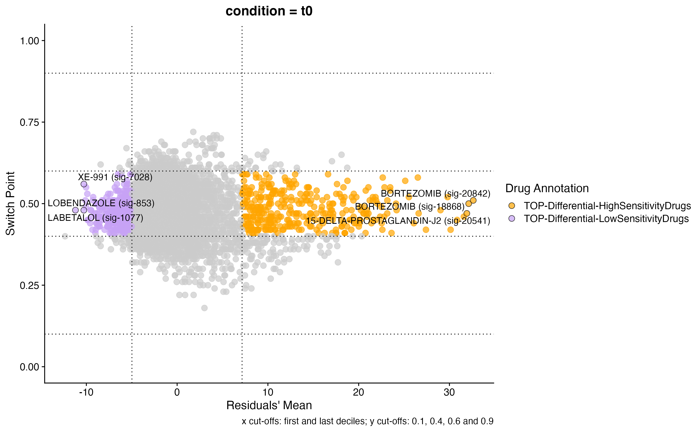
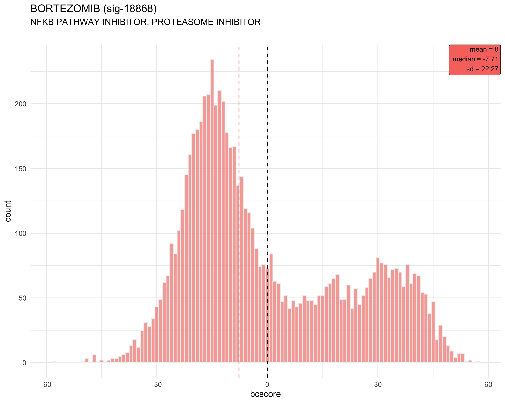
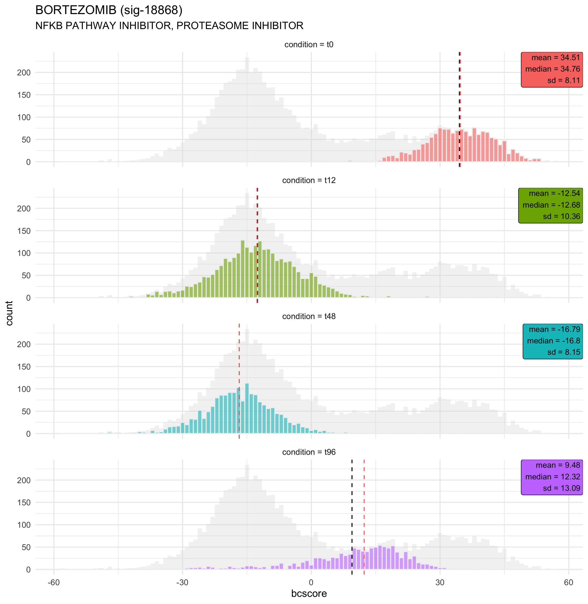

# Visualization of the results
**beyondcell** provides several visualization functions to help you better understand the results.

|**Function** | **Description** |
  |--------------|--------------|
  |**`bcClusters()`** |Returns a ggplot object with the UMAP reduction (either beyondcell's or Seurat's) colored by the specified metadata column.|
  |**`bcSignatures()`** |Returns a list of patchwork objects containing ggplot2s with the desired UMAP reduction (either beyondcell's or Seurat's) colored by bcscores or gene expression values.|
  |**`bcHistogram()`** |Drawns a histogram plot of bcscores for each signature of interest. The plot can be a single histogram (if idents = NULL) or a histogram for each level found in idents.|
  |**`bcCellCycle()`** |Drawns, for each signature of interest, a violindot plot of the bcscores grouped by the cell cycle phase (G1, G2M or S). Note that this information must be present in `bc@meta.data` and can be obtained using Seurat's function `CellCycleScoring`.|
  |**`bc4Squares()`** |Returns a 4 squares plot of the drug signatures present in a beyondcell object. |

## Data
In this tutorial, we are analyzing a population of MCF7-AA cells exposed to 500nM of bortezomib and collected at different time points: t0 (before treatment), t12, t48 and t96 (72h treatment followed by drug wash and 24h of recovery) obtained from *Ben-David U, et al., Nature, 2018*. We integrated all four conditions using the Seurat pipeline. After calculating the beyondcell scores (BCS) for each cell and regressing unwanted sources of variation, a clustering analysis was applied. 

## Metadata visualization
Once the BCS and the UMAP reductions are computed, we can check out how the different available metadata variables behave. General quality control variables, such as the number of features per cell or the cell cycle phase can be analyzed with the `bcClusters` function (previously shown). We can visualize the **therapeutic clusters**:

```r
# Beyondcell UMAP
bcClusters(bc, UMAP = "beyondcell", idents = "bc_clusters_res.0.2", pt.size = 1)
```


Or condition-based metadata: 

```r
bcClusters(bc, UMAP = "beyondcell", idents = "condition", pt.size = 1)
```


Also, when available, the Seurat reduction can be plotted. This will allow us to detect the location of the therapeutic clusters in the *original* expression UMAP.

```r
# Expression UMAP
bcClusters(bc, UMAP = "Seurat", idents = "seurat_clusters", pt.size = 1)
```


## Visualize drug signatures and markers
In this example, we have analyzed the Ben-David *et* al. dataset using the drug perturbation signature collection or **PSc**. As these cells have been previously treated with bortezomib, a Protease inhibitor drug, we expect to identify a differential susceptibility pattern between the available conditions.

First, we look for Bortezomib's presence in the PSc collection. We can do this using the `FindDrugs` function implemented in the package.

```r
FindDrugs(bc, "BORTEZOMIB")

```
|Original_Name  | bc_Name |  Preferred_Name | Name | sig_id | Preferred_and_sig | MoA |
|---------------|---------|-----------------|------|--------|-------------------|-----| 
|BORTEZOMIB |sig_1866 | BORTEZOMIB | BORTEZOMIB | sig_1866  | BORTEZOMIB (sig_1866) | PROTEASOME INHIBITOR |
|BORTEZOMIB | sig_18868| BORTEZOMIB | BORTEZOMIB | sig_18868 | BORTEZOMIB (sig_18868) | PROTEASOME INHIBITOR | 
|BORTEZOMIB | sig_20842 | BORTEZOMIB | BORTEZOMIB | sig_20842 | BORTEZOMIB (sig_20842) | PROTEASOME INHIBITOR | 

Then, we run the `bcSignatures` function using the *sig_id* of the drug. If you input more than one sig_id, the result will be a patchwork object containing all the signature plots. 

```r
bcSignatures(bc, UMAP = "beyondcell", signatures = list(values = "sig_18868"), pt.size = 1)
```


We can also take a look at the behaviour of specific gene expression markers, such a PSMA5, a gene targeted by bortezomib.

```r
bcSignatures(bc, UMAP = "beyondcell", genes = list(values = "PSMA5"), pt.size = 1)
```


## Ranking visualization
We can summarize the ranking results using the `bc4Squares` function. This function summarizes the top hits obtained for each of the specified condition levels. The residuals are represented in the x axis, the switch point is represented in the y axis. The top-left and bottom-right corners contain the drugs to which all selected cells are least/most sensitive, respectively. The centre quadrants show the drugs with an heterogeneous response. In this case, we can clearly see how the tool predicts an heterogeneous response to bortezomib. 

```r
bc4Squares(bc, idents = "condition", lvl = "t0", top = 5)
```



## Visualize BCS distribution
The `bcHistogram` function can help us analyze the differences in the distribution of the BCS for specific signatures.

```r
# General view
bcHistogram(bc, signatures = "sig_18868", idents = NULL)
```


```r
# Condition-based histograms
bcHistogram(bc, signatures = "sig_18868", idents = "condition")
```


## Visualize Cell cycle phases
For each drug of interest, we can also take a look at the differences of BCS depending on the cell cycle phase of the cells. This aims to help the user understand the effect the cell cycle is having on the predicted drug response.

```r
bcCellCycle(bc, signatures = "sig_18868")
```


## Support
Additional information can be found in the package's R documentation. If you have any question regarding the use of **Beyoncell**, feel free to submit an [issue](https://gitlab.com/bu_cnio/Beyondcell/issues).

